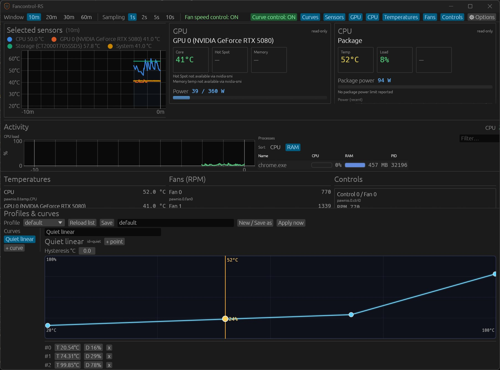

<p align="center">
  
</p>

<h1 align="center">fancontrol-rs</h1>

<p align="center">
  <strong>Windows fan control and system activity (CPU / RAM) in Rust.</strong><br>
  Open-source option next to tools like FanControl and Argus Monitor.<br>
  Inspired by <a href="https://github.com/Rem0o/FanControl.Releases">FanControl</a> (Rem0o). Not affiliated.<br>
  PawnIO only (no WinRing0) · profiles & curves · live UI
</p>

<p align="center">
  
  
  
  
  
</p>

<p align="center">
  
</p>

## Motherboard support

**Every desktop motherboard with a Super I/O / EC HWM path should be able to work** - we aim for broad chip coverage (Nuvoton NCT668x, banked NCT679x, ITE IT87, and friends) via [PawnIO](https://pawnio.eu/).

What we still need from the community is **logs so we can certify** each model (read sensors, fan RPM, and optional PWM write). Without a report, we will not mark a board as certified even if the code path exists.

| | |
|--|--|
| **Certified so far** | NCT6687D-class EC HWM · **ASUS ROG STRIX B550-A GAMING** (banked NCT / NCT6798-class) - full read + PWM write on maintainer hardware |
| **Help wanted** | Any other board (ASUS / MSI / Gigabyte / ASRock / …). Paste `detect` + `list-sensors` + `list-controls` and open a [Hardware report](https://github.com/Leyukaka/fancontrol-rs/issues/new?template=hardware_report.yml) |
| **How** | Install [PawnIO](https://pawnio.eu/), run **as Administrator**, follow [docs/SUPPORTED_HARDWARE.md](./docs/SUPPORTED_HARDWARE.md#contributing-a-chip--board-report) |

Binaries are **unsigned** (SmartScreen may warn). PWM writes are on by default after first-run consent - use `--read-only` if you only want sensors.

## Features

- **Fan control**: curves, profiles, live duty sliders, multi-sensor temperature graph
- **Activity deck**: CPU load history + top processes (CPU % and RAM), filter and sort (default on, can be turned off in Options)
- **Security**: [PawnIO](https://pawnio.eu/) only for Super I/O / EC. Never ships WinRing0 or other known-vulnerable ring-0 drivers
- **Host sensors**: NVIDIA GPU multi-metric via fixed-path `nvidia-smi` (temp, power W, util, clocks, VRAM, fan %) + GPU detail panel; SSD/NVMe temps via DeviceIoControl (no PowerShell)
- **Metrics (v0.4)**: graph multi-kind series (GPU power/util/…; W scale from power limit), optional local SQLite store + CSV export; see `docs/METRICS_AND_OTEL.md`
- **Start with Windows**: Options + first-run prompt (current-user Run key, no admin)
- **UI**: egui desktop app, system tray, first-run write consent, 8 languages (en/fr/de/es/it/zh/ja/lb)
- **CLI**: `sample`, `list-sensors`, `list-controls`, `test-duty`, `sample-storage`, …
- **Optional fun**: shader graph styles (wgpu) in Options
- Spec-driven design: decisions live under [`specs/`](./specs)

## Compared to other tools

Not affiliated with FanControl, Argus Monitor, LibreHardwareMonitor, or any OEM brand.  
Rough map of the Windows landscape. Support always depends on your board and EC.

| Software | License | Focus | Curves / profiles | Notes | Maturity |
|----------|---------|--------|-------------------|-------|----------|
| [FanControl](https://github.com/Rem0o/FanControl.Releases) (Rem0o) | Free | Fan control + **plugins** | Strong multi-curve setup | Large community; default pick for many desktops | Mature |
| [Argus Monitor](https://www.argusmonitor.com/) | **Paid** (trial) | Monitoring suite + fans | Strong; synthetic temps, AIO, etc. | Closed source; also drive/SMART oriented | Mature |
| [LibreHardwareMonitor](https://github.com/LibreHardwareMonitor/LibreHardwareMonitor) | Open source | **Sensors / monitoring** | Not a full fan-control app | Often used under other tools | Mature (monitor) |
| [HWiNFO](https://www.hwinfo.com/) | Free / Pro | Logging & sensors | Not for PWM curves | Pair with a fan app if you need control | Mature (monitor) |
| SpeedFan | Free (legacy) | Old all-in-one | Dated UI | Often fails on modern boards | Legacy |
| [NBFC](https://github.com/hirschmann/nbfc) (and forks) | Open source | **Laptops** | Per-model configs | Desktop Super I/O is a different problem | Mature niche |
| MSI Afterburner | Free | **GPU** OC + GPU fans | GPU fan curve | Not a full motherboard fan suite | Mature (GPU) |
| OEM apps (Armoury Crate, Gigabyte CC, …) | Free with board | Vendor board / RGB / fans | Varies | Heavy; brand-locked | Mature |
| AIO / case apps (iCUE, CAM, …) | Free / freemium | Their pumps, fans, RGB | Good **inside** that ecosystem | Weak for random mobo headers | Mature niche |
| **fancontrol-rs** (this repo) | MIT / Apache-2.0 | Fans + **Activity** (CPU load, top processes) | Curves, profiles, sliders, multi-sensor graph, metrics store | **PawnIO only** (no WinRing0); egui UI; **all boards welcome** - certified list is short until you send logs; binaries unsigned | Early (v0.4.x) |

**Quick pick**

| You want… | Often a fit |
|-----------|-------------|
| Max features and plugins, battle-tested | FanControl |
| Paid all-in-one (fans + disks + polish) | Argus Monitor |
| Sensors / logging only | LibreHardwareMonitor, HWiNFO |
| Laptop EC control | NBFC |
| GPU fans only | Afterburner |
| Brand AIO / RGB ecosystem | iCUE, CAM, etc. |
| Open source, PawnIO-only I/O, fan UI + CPU/RAM activity; help certify more boards with logs | **fancontrol-rs** |

## Specs

| Document | Description |
|----------|-------------|
| [00-overview](./specs/00-overview.md) | Vision & principles |
| [01-product](./specs/01-product.md) | Product requirements |
| [02-architecture](./specs/02-architecture.md) | Architecture & crates |
| [03-hardware-backend](./specs/03-hardware-backend.md) | PawnIO & hardware access |
| [04-ui](./specs/04-ui.md) | UI requirements |
| [05-plugins](./specs/05-plugins.md) | Plugin system |
| [06-roadmap](./specs/06-roadmap.md) | Development phases |

## Docs

| Document | Description |
|----------|-------------|
| [CONTRIBUTING.md](./CONTRIBUTING.md) | Bugs, PRs, AI contribution policy |
| [docs/SUPPORTED_HARDWARE.md](./docs/SUPPORTED_HARDWARE.md) | Chip matrix, prerequisites, validation |
| [docs/SIGNING_AND_DISTRIBUTION.md](./docs/SIGNING_AND_DISTRIBUTION.md) | Signing options, release checklist, CI notes |
| [docs/SECURITY.md](./docs/SECURITY.md) | Reporting, CodeQL/audit, SHA256 verify, signing/auto-update status |

## Status

**v0.4.0**. NCT668x + banked NCT (ROG B550-A) **certified**; other boards should work - **send logs to certify**. Curves on **CPU-like temps only**, multi-kind graph (GPU metrics), Activity deck, optional metrics store, Start with Windows.  
Public source of truth: this repo ([Releases](https://github.com/Leyukaka/fancontrol-rs/releases), issues, PRs).

| Crate | Role |
|-------|------|
| `fancontrol-core` | Models, curves, profiles, channel map, control loop |
| `fancontrol-plugins` | Traits, mock, host sensors, CPU activity |
| `fancontrol-pawnio` | PawnIO FFI + LpcIO + NCT668x / banked NCT HWM |
| `fancontrol-ui` | egui app |
| `fancontrol-rs` | CLI + binary entry |

Validated hardware:
- **Nuvoton NCT6687D-class** EC (id `0xD5` rev `0x92` @ `0x0A20`)
- **Banked NCT** on **ASUS ROG STRIX B550-A GAMING** (id `0xD4` rev `0x2B` @ `0x2E` / HWM `0x0290`) - PWM OK

Details: [docs/SUPPORTED_HARDWARE.md](./docs/SUPPORTED_HARDWARE.md).

## Download

- **[GitHub Releases](https://github.com/Leyukaka/fancontrol-rs/releases)**: tags `v*.*.*` build `fancontrol-rs.exe` + SHA256 on `windows-latest` (see [release workflow](./.github/workflows/release.yml)).
- **Build from source**: see below.

Binaries are **not code-signed yet**. Expect SmartScreen and occasional Defender false positives. Signing plan: [docs/SIGNING_AND_DISTRIBUTION.md](./docs/SIGNING_AND_DISTRIBUTION.md).

## Prerequisites (hardware)

1. **[PawnIO](https://pawnio.eu/)** is required for Super I/O / EC access. Not bundled: install the official package first. Without it the app still starts (mock / config / host sensors); the UI explains if the backend cannot open.
2. **Administrator**: live HWM / `pawnio_open` needs elevation.
3. Compatible board: **NCT668x EC** is the validated path; see [docs/SUPPORTED_HARDWARE.md](./docs/SUPPORTED_HARDWARE.md).

## Building

```bash
cargo build --release
cargo test --workspace
cargo clippy --workspace --all-targets -- -D warnings
```

Release binary: `target/release/fancontrol-rs.exe`.

## Windows Defender / SmartScreen / VirusTotal

The app talks to **PawnIO** (kernel I/O), may spawn **nvidia-smi** for GPU temps, and reads SSD temps via native storage APIs (no PowerShell). Unsigned builds that touch hardware drivers often get heuristic flags (same class of tools as FanControl / LibreHardwareMonitor).

- Prefer official Releases and verify **SHA256**: [docs/SECURITY.md](./docs/SECURITY.md).
- PWM writes are on by default; `--read-only` is quieter for scanners and safer for diagnostics.

**Do not disable Defender.** For local builds, exclude the folder:

1. Windows Security → Virus & threat protection → Manage settings  
2. **Exclusions** → Add exclusion → **Folder**  
3. Add `C:\projet\fancontrol-rs\target` (or the whole repo if needed)  
4. If quarantined: Protection history → restore `fancontrol-rs.exe`

Use an **elevated** terminal for real hardware, or PawnIO open fails with access denied.

## Safety

- **Never** WinRing0 or known-vulnerable ring-0 drivers.
- PWM writes are **on by default** (UI + curve control). Use `--read-only` when you only want sensors.
- Prefer `sample` / `list-sensors` / `list-controls` before writing casually.

## CLI

```bash
cargo run -- list-sensors
cargo run -- list-controls
cargo run -- sample
cargo run -- sample-storage --times 3
cargo run -- map-init
cargo run -- backend-status
cargo run -- init-profile --hw
```

## UI

Bare exe (or no subcommand) opens the **UI** with PWM writes and curve control on (first-run confirmation). Mock channels need `--mock`.

```bash
cargo run --release
# same as: cargo run --release -- ui

cargo run -- --mock --no-hw ui
cargo run -- --hw-only ui
cargo run -- --read-only ui
```

Rename channels: `channel-map.json` in the app config dir (`map-init` creates it).

## Contributing

Bug reports and PRs welcome. Read **[CONTRIBUTING.md](./CONTRIBUTING.md)** first (issue-first for non-trivial work, quality gates, hardware safety, AI disclosure).

## License

MIT OR Apache-2.0

## Credits

- Inspired by Rémi Mercier ([@Rem0o](https://github.com/Rem0o)) and LibreHardwareMonitor.
- PawnIO by [namazso](https://github.com/namazso).

## Support

[](https://buymeacoffee.com/leyukaka)
